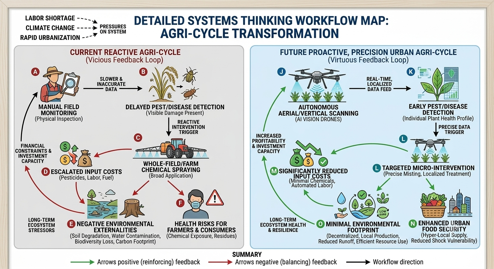
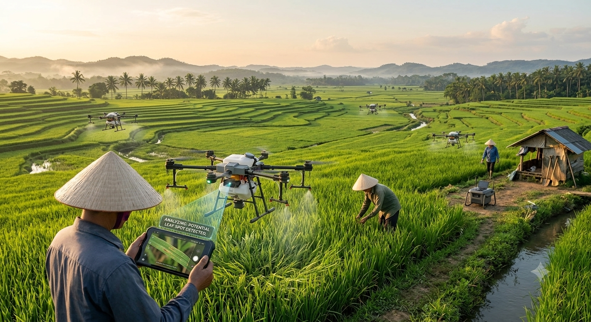
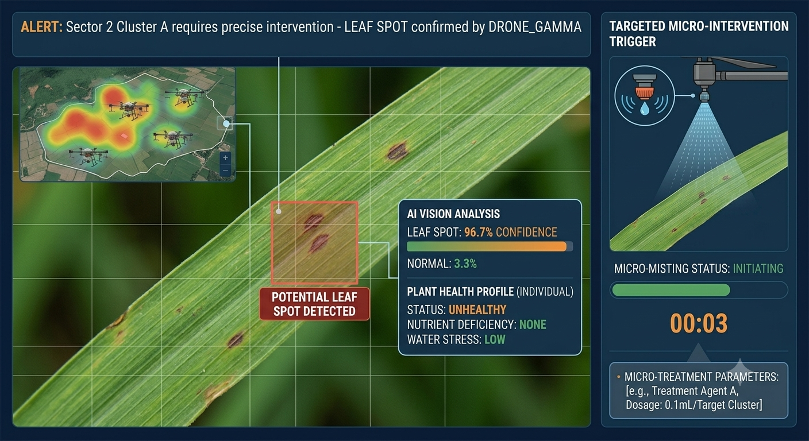
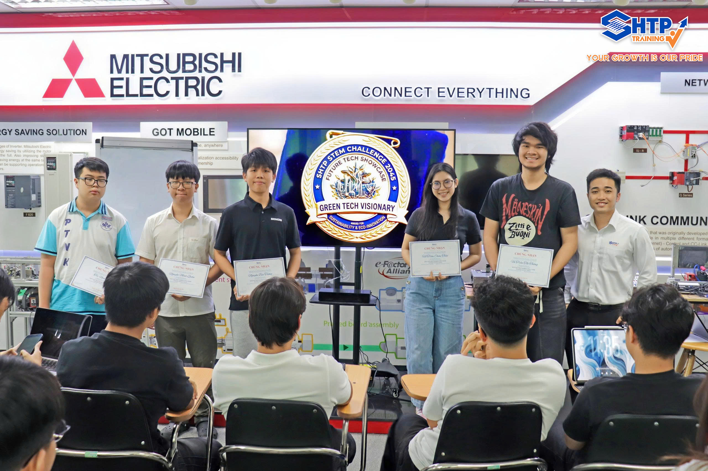

# STARTUP PROFILE: THE CHRONICLES OF ARCHITECTING SMART SOCIETY 2045

## 🐞 1. STARTUP NAME: Debug
* **Slogan:** Spot the pest, save the rest
* **Class:** [STEM.03.26]

### 👥 Co-Founding Team: 
1. **Hồ Trần Châu Thảo** - **CEO (Chief Strategist):**
* **Responsibilities:** Conceptualizing the core idea, driving the product vision, and leading the team to build the drone system from the ground up.

2. **Nguyễn Bảo Tường** - **Social Researcher:**
* **Responsibilities:** [e.g., Gathering statistical data, mapping customer pain points, and identifying community needs.]

3. **Nguyễn Minh Quân** - **Technology Architect:**
* **Responsibilities:** Creating, crafting, consolidating new frontiers of technology to apply to the products.

4. **Trì Nam An** - **UX/Experience Designer:**
* **Responsibilities:** Designing intuitive user experiences and interfaces, creating user flows and prototypes, and ensuring seamless interaction between users and the drone system across all touchpoints.

5. **Vũ Trần Tất Thắng** - **Venture Investor:**
* **Responsibilities:** Assessing project feasibility, performing economic analyses, and designing the business model for an AI drone system for plant health monitoring and pest/disease prevention.

---
## ⚠️ 2. PROBLEM STATEMENT & SYSTEMS THINKING ANALYSIS
* **Core Problem Statement:** Vietnamese farmers are trapped in an inefficient, reactive, and non-targeted crop management cycle, leading to high operational costs, significant environmental and health externalities, and reduced productivity. This precarious situation is severely compounded by a chronic and growing shortage of agricultural labor.
* **Cause-and-Effect Deep Dive:**
  * 🪾**Root Causes:**
  * [ ] Manual Monitoring Inefficiencies: Reliance on physical, human inspection of fields, which is extremely time-consuming, subjective, and practically impossible at scale, especially during later crop growth stages.
  * [ ]  Technological Gap: Absence of accessible, real-time, high-resolution data regarding specific pest or disease outbreaks within the vast field landscape.
  * [ ]  Labor Market Dynamics: Aging agricultural population and significant migration of younger workers from rural areas to urban centers, leaving a void in the farm workforce.
  * [ ]  Treat-After-Infestation Mindset: Traditional farming practices that favor whole-field remedial spraying after damage is already visible, rather than proactive, targeted preventative measures.
  * 🌾**Direct Consequences:**
    * [ ] Reactive & Delayed Response: Pests/diseases are detected only after significant spread, leading to extensive crop damage and yield loss.
    * [ ]  Escalated Input Costs: Financial strain from purchasing large quantities of chemical pesticides and paying for scarce, high-cost manual labor.
    * [ ]  Negative Externalities: Comprehensive spraying causes substantial environmental degradation (soil erosion, water contamination, loss of biodiversity) and increases acute and chronic health risks for farmers exposed directly to toxic chemicals.
    * [ ]  Compromised Food Security: The combined effects of reduced yields and residue-contaminated produce threaten local and national food supplies.

**Workflow:*
 

---

## 💡 3. STARTUP ARCHITECTURE & BUSINESS MODEL
* **Target Customers:** Large-scale commercial farmers, agricultural cooperatives, and farm management businesses facing labor shortages, high operational costs, and crop health challenges.
* **Startup's Core Solution:** An autonomous drone system equipped with a scanning camera that continuously patrols agricultural fields to detect pest-infested or diseased leaves. The system sends real-time alert notifications to farmers, enabling precise, targeted treatment rather than whole-field chemical spraying, which saves time, cuts costs, and protects the environment.
* **Core Technology Stack:**
  * [ ] **AI Vision (Computer Vision):** Real-time image processing of camera feeds to detect, classify, and pinpoint specific leaf diseases and pest damage.
  * [ ] **Robotics/UAVs & Actuators:** Autonomous drone (UAV) systems programmed for automated, precise flight paths over agricultural fields.
  * [ ] **IoT & Cloud Infrastructure:** Transmitting scanned field data and pushing instant alert notifications to the farmer's smartphone or centralized management dashboard via the cloud.
  * [ ] **Green Energy (Sustainability):** Driving eco-friendly agriculture by drastically reducing chemical pesticide use. This precision spraying approach minimizes toxic runoff into surrounding ecosystems and waterways, while the drones themselves operate on energy-efficient, rechargeable batteries.
  * [ ] **Big Data & Predictive Analytics:** Processing historical field scans to forecast seasonal pest outbreaks
---

## 🎨 4. SMART SOCIETY VISUAL CONCEPTION 2045

 
 

---

## 🧠 5. REFLECTION & KNOWLEDGE DISCOVERY
Following a 3-week journey of intensive co-creation, our founding team has distilled the following key insights:
* **We discovered that:** Farmers don't just need weather or pest alerts; they need immediate, accurate diagnoses and step-by-step treatment guides the moment risks appear.
* **We learned that:** Translating a complex agricultural database into a simple, human-centered interface is the key to helping farmers make confident decisions.
* **Our most unique innovation/competitive edge is:** Crop Guard’s unique advantage is combining real-time threat detection with precise agricultural treatments, giving users a complete and proactive crop protection shield.

---

🌐 *Project profile meticulously curated by Debug in preparation for the **Future Tech Showcase - Demo Day**.*

## 🏆 7. OFFICIAL EVALUATION RESULTS FROM THE JUDGING PANEL (DEMO DAY OFFICIAL SCORE)

| Evaluation Criteria from the Panel | Max Score | Judges' Score | In-depth Feedback from the Judging Panel |
| :--- | :---: | :---: | :--- |
| **1. Major Problem Solving & Systems Thinking** | 20 | **17** / 20 | Good analysis of cumulative impacts of agricultural chemicals. |
| **2. Innovation & Breakthrough Solution** | 20 | **18** / 20 | Breakthrough "Debug" source code mindset applied to agriculture, accurately targeting specific diseased leaves instead of blanket spraying. |
| **3. Tech Stack Depth & Technical Feasibility** | 20 | **18** / 20 | Logical integration of AI Vision on autonomous Drones; real-time image processing pipeline achieves high accuracy. |
| **4. Social Impact & Human-Centered Value** | 15 | **14** / 15 | High social impact in reducing toxic chemicals; needs to clarify revenue model (hardware sales vs DaaS model). |
| **5. Collaboration & Teamwork Ability** | 15 | **13** / 15 | Clear 5-pillar role division; however, a few members need to participate more actively. |
| **6. Presentation Skills & Defense (Q&A)** | 10 | **9** / 10 | Confident English pitching, strictly on time; sharp defense regarding investment costs for farmers. |
| **🥇 OFFICIAL TOTAL SCORE** | **100** | **89 / 100** | **FINAL RANKING: GOOD** (Excellent in Environmental Impact) |

## 🎖️ 8. HONORARY TITLES & TECHNOLOGY BADGES

Based on the project's outstanding strengths, the Judging Panel and SHTP Training proudly award the following prestigious Technology Badge to the young founding team.

### 🌟 **CONGRATULATIONS TO THE STARTUP FOR WINNING THE HONOR:**

## 🏅 **[GREEN TECH VISIONARY BADGE]** 🏅

> *"Honoring green agricultural solutions, pioneering the elimination of toxic chemical habits, protecting soil and groundwater environments, and optimizing the carbon footprint."*

💬 *"From sand to AI. From ideas to innovation. From students today… to engineers of tomorrow!"*  
Closing the journey of STEM Challenge 2045 with immense pride at SHTP Training Center.
